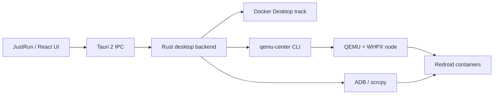

# JustRun

JustRun 是一个面向 Android 自动化开发、设备管理、云手机控制和授权测试的 Windows 桌面平台，底层使用 **Tauri 2 + React + TypeScript + Rust**，通过 Docker Desktop 或 QEMU/WHPX 节点运行 Redroid，并使用 ADB、scrcpy 和设备文件/应用接口进行控制。


> **当前定位**：Windows x64 技术 Beta。Docker 轨道和 QEMU/WHPX 轨道都应以项目文档和现场验收结果为准；自动化测试通过不等于真实设备、安装包、视觉界面或长时间稳定性已经全部验证。

## 目录

- [文档内容](#文档内容)
- [English version](README_EN.md)

---

## 文档内容

### 1. 项目定位

本项目解决的是“在一台电脑上管理多个 Redroid Android 设备”的工程问题，而不是单纯提供一个 Android 模拟器。它把设备生命周期、ADB 连接、应用安装、文件管理、投屏、日志、容器/虚机运行时和可选预装能力放到一个桌面界面里。

项目有两条运行轨道：

| 轨道 | 运行位置 | 适合场景 | 主要依赖 |
|---|---|---|---|
| Docker 轨道 | 本机 Docker Desktop / WSL2 | 快速创建多个 Redroid 容器、日常开发和自动化 | Docker Desktop、WSL2、binder、ADB、Redroid 镜像 |
| QEMU/WHPX 轨道 | QEMU 虚机节点内的 Docker | 需要 guest 内核边界、便携节点状态或独立节点管理 | WHPX、QEMU、OpenSSH、Ubuntu cloud image、ADB |

QEMU 轨道的隔离边界是“节点级”：同一台 VM 内的多个 Redroid 容器共享 guest 内核，只拥有 Docker namespace/cgroup 隔离。需要真正的内核级隔离时，应为实例创建独立节点。

### 2. 重要边界和安全提醒

- **Windows x64 是首要支持目标**。Windows ARM64、Linux 和 macOS 有实验性路径或资产说明，但不应直接当作稳定 Beta 承诺。
- **Docker 容器状态为 Up 不代表 Android 已经可用**。必须继续等待 ADB 状态变为 `device`；`offline`、`unauthorized` 和 `Up` 不能混为一谈。
- **GApps 必须匹配 Android 版本和 ABI**。当前仓库内的 MindTheGapps 资产是 Android 13、x86_64，不能用于 Android 14。
- **不要硬杀 QEMU**。优先使用页面或 `qemu-center vm stop` 通过 QMP/ACPI 优雅关机；硬杀可能给 qcow2 留下损坏标志。
- **Root、Zygisk、LSPosed、Shamiko、设备伪装和痕迹清理只能用于你拥有或已获明确授权的设备、应用和网络**。不得用于绕过未获授权的第三方安全控制；任何使用后果由使用者自行承担，与作者和维护者无关。
- **受保护的 QEMU 预装流程有授权边界**。签名 grant、设备证明、执行票据和一次性 JTI 不是普通命令行参数，复制 CLI 或离线伪造路径不能代替有效授权。

### 3. 能力概览

| 模块 | 能力 |
|---|---|
| Dashboard | Docker/ADB 状态、CPU/内存、设备摘要、系统通知、最近日志和截图入口 |
| 设备中心 | 搜索、筛选、多选、批量连接/断开/重启/停止、HOME/BACK/RECENT、锁屏、亮屏、截图、安装 APK |
| 设备详情 | 启动/停止/重启、ADB 控制、截图、Logcat、Shell、文件管理、应用管理、Root/伪装状态 |
| 容器与节点 | 统一入口管理 Docker 和 QEMU 两条轨道，显示来源、运行状态和只读资源对比 |
| Docker | 创建 Redroid、检查名称和 ADB 端口、预装 GApps/Root、查看容器日志、复制 serial |
| QEMU/WHPX | 环境体检、WHPX/QEMU/镜像准备、VM 创建/启停/删除、guest 等待、实例创建/升级/恢复、验收 |
| ADB | Server 维护、设备连接、无线 ADB 局域网扫描、记住上次地址、复制 serial |
| APK | 批量安装 APK、在线设备全选、离线确认、逐项显示结果 |
| Volumes | 查看和清理 Docker 数据卷；容器删除不会自动删除对应卷 |
| Logs | 内存日志、按天落盘日志、导出和打开日志目录 |
| Settings | Docker/ADB/scrcpy/gnirehtet 路径检测、语言、主题、自动启动、运行策略和配置导入导出 |
| Terminal | 本地终端会话、设备 Shell 和受控的终端输入/输出 |
| 预装能力 | GApps、Magisk/Zygisk、LSPosed、Shamiko、DeviceCloak、设备档案、ABI 和痕迹清理 |

顶部窗口使用自定义无边框标题栏：顶部空白区可拖动，右侧提供最小化、最大化/还原和关闭按钮，窗口边缘及四角支持原生缩放；关闭到托盘设置仍由现有关闭拦截逻辑处理。

### 4. 技术栈和仓库结构

#### 技术栈

| 层 | 技术 | 作用 |
|---|---|---|
| 桌面壳 | Tauri 2 | 窗口、托盘、文件对话框、更新器、全局快捷键和 Rust IPC |
| 前端 | React 19、TypeScript、React Router 7 | 页面、路由、交互和类型安全 |
| 构建/测试 | Vite 7、Vitest、Testing Library、jsdom | 开发服务器、生产构建和前端测试 |
| 前端状态 | Zustand | 设置、设备、运行轨道和异步操作状态 |
| 后端 | Rust 2021、Tokio、Serde、Reqwest、SQLite | 本机探测、Docker/ADB、QEMU 桥接、授权和日志 |
| Android 运行时 | Redroid、ADB、scrcpy | Android 容器、设备控制、投屏和调试 |
| 虚机轨道 | QEMU、WHPX、Ubuntu cloud image | 节点级 guest 内核和 Docker 运行时 |

#### 目录结构

```text
JustRun/
├─ src/                         # React 页面、组件、i18n、stores、services 桥
│  ├─ components/               # 布局、控件和可复用 UI
│  ├─ pages/                    # Dashboard、Devices、Runtime、ADB、APK 等页面
│  ├─ services/                 # 前端到 Tauri command 的薄封装
│  ├─ stores/                   # Zustand 状态
│  └─ i18n/                     # zh-CN / en-US 词典
├─ src-tauri/                   # Tauri Rust 后端和桌面配置
│  ├─ src/commands/             # 暴露给前端的命令
│  ├─ src/services/             # Docker、ADB、QEMU、授权、日志等服务
│  ├─ capabilities/             # Tauri ACL capability
│  ├─ icons/                    # 桌面、托盘和安装包图标
│  └─ tauri.conf.json           # 窗口、构建、资源和打包配置
├─ qemu-center/                 # 独立 QEMU/WHPX CLI crate，不加入根 workspace
├─ authorization-service/       # 受保护执行流程使用的授权服务组件
├─ scripts/                     # 平台检测、WSL binder、资产和发布脚本
├─ vendor/                      # 本地 GApps/Magisk/模块等资产，不进 Git
├─ docs/                        # 安装、兼容性、排障、QA、方案和计划
├─ tests/                       # 前端布局、配置和跨模块回归测试
├─ public/                      # 前端静态资源，例如 JustRun Logo
├─ package.json                 # Node/Vite/Tauri 脚本
├─ README.md                   # 中文项目文档
└─ README_EN.md                # English documentation
```

#### 运行时架构



### 5. 支持范围和兼容性

| 主机/组合 | 状态 | 说明 |
|---|---|---|
| Windows x64 + Docker | 部分验证 / Beta 目标 | 需要 Docker Desktop、WSL2、binder、ADB 和匹配 Redroid 镜像 |
| Windows x64 + QEMU/WHPX | 部分验证 / 实验性 | 需要 WHPX、QEMU、OpenSSH、Ubuntu cloud image 和足够磁盘 |
| Windows ARM64 | 实验性 | 必须使用 ARM64 WSL 内核和匹配架构的镜像，不能使用 x64 `bzImage` |
| Linux x64/ARM64 | 实验性 | 使用宿主 binder，不安装 Windows WSL 内核；镜像 ABI 必须匹配 |
| macOS | 实验性 | binder 必须由 Docker Desktop Linux VM、QEMU 或远程 Linux 提供 |
| Android 13 + x86_64 | 当前主要目标 | 与仓库中的 GApps 资产匹配 |
| Android 14 + Android 13 GApps | 不支持 | 创建前必须拒绝，不能继续预装 |

详细状态请以 [`docs/compatibility.md`](docs/compatibility.md) 为准。该文件区分“已验证、部分验证、实验性、不支持、未验证”，不会因为代码或单元测试通过就自动提高兼容性等级。

### 6. 从源码开始

#### 6.1 开发环境

最小开发依赖：

- Node.js 20 或更高版本；版本要求来自 `package.json` 的 `engines.node`。
- npm。
- Rust stable 和 Cargo。
- Windows 开发时建议使用 Windows x64，并确保 WebView2 运行环境可用。
- 如果要实际运行 Docker 或 QEMU，还需要对应轨道的运行依赖；只启动前端不需要这些后端工具。

#### 6.2 安装依赖并启动 Tauri

```powershell
cd F:\code\project\Android-Device
npm install
npm run tauri dev
```

`npm run tauri dev` 会先启动 Vite，再启动 Rust/Tauri 桌面窗口。应用默认使用 `http://127.0.0.1:1420` 作为开发前端地址。

如果 1420 或 1421 端口已被旧的 Vite 进程占用，先停止属于本项目的残留开发服务，再重新执行命令；不要误杀其他项目的 Node 进程。

#### 6.3 只预览前端

```powershell
npm run dev
```

浏览器预览用于查看页面、布局和部分 mock 数据，不提供真实 Docker、ADB、scrcpy、QEMU、托盘和原生窗口行为。不要把浏览器预览当作桌面功能验收。

#### 6.4 构建和打包

```powershell
# 类型检查 + Vite 生产构建
npm run build

# Tauri 开发构建/安装包
npm run tauri build
```

默认安装包通常位于：

```text
src-tauri/target/release/bundle/nsis/
```

图标资源来自 `src-tauri/icons/`；当前桌面图标由 `public/justrun-logo.png` 生成。如果只替换图标，必须重新生成图标并重新构建/重启应用，Windows 任务栏或快捷方式可能还会缓存旧图标。

#### 6.5 带更新器配置的发布构建

`npm run tauri:build:release` 会拒绝没有 HTTPS 更新地址和签名公钥的发布构建：

```powershell
$env:RDC_UPDATE_ENDPOINT = "https://updates.example.invalid/justrun/latest.json"
$env:RDC_UPDATE_PUBKEY = Get-Content -Raw -LiteralPath ".\\release\\tauri-updater-public-key.txt"
npm run tauri:build:release
```

受保护 QEMU guest loader 的发布构建还需要根据发布环境提供 `RDC_AUTH_EXECUTION_RELEASE_URL` 和 `RDC_AUTH_PUBLIC_KEYS`。不要把服务端签名私钥放进桌面构建环境。

### 7. Docker 轨道

Docker 轨道是本机开发和日常使用的首选路径：Docker Desktop 负责容器运行时，JustRun 负责设备实例、ADB、日志、截图和管理界面。

#### 7.1 依赖和首次准备

- Windows：Docker Desktop、WSL2、可用的 WSL binder、ADB；需要投屏时再准备 scrcpy。
- Linux：Docker、宿主机 binder、ADB；不使用 Windows WSL 内核脚本。
- macOS：Docker Desktop 提供 Linux VM；binder 和镜像架构必须与 Docker VM 匹配。
- Redroid 镜像：必须选择和主机架构、Android 版本、内核能力相匹配的镜像。

Windows 可以先执行平台检测：

```powershell
.\scripts\detect-platform.ps1
```

需要安装或更新 WSL 内核时：

```powershell
.\scripts\install-wsl-kernel.ps1 -Apply
# 或使用一键 binder 流程
.\scripts\setup-wsl-binder-oneclick.ps1 -Apply
```

这些脚本只处理 WSL 内核/binder 相关准备，不会替代 Docker Desktop 安装，也不会自动解决镜像 ABI 不匹配。脚本行为和平台限制详见 [`scripts/README-WSL-KERNEL.md`](scripts/README-WSL-KERNEL.md)。

#### 7.2 创建第一台基础设备

建议第一次先创建“不带 GApps、root 和高级模块”的基础设备，先确认最小链路可用：

1. 启动 Docker Desktop，并确认 Docker daemon 可用。
2. 打开 JustRun 的“容器与节点”，选择 Docker 轨道。
3. 检查 Docker、WSL/binder、ADB 和镜像状态。
4. 创建设备，先使用默认或最小资源配置。
5. 等待容器启动并在 ADB 设备列表中出现。
6. 打开设备详情，验证截图、shell、文件和日志等能力。

“启动成功”只代表容器进程已启动；“在线”还要求 ADB 已连接；“可投屏”还要求 scrcpy 和设备图形能力正常。若设备显示为离线，应先查看容器日志和 ADB 状态，不要反复点击启动按钮。

#### 7.3 GApps 预装

当前仓库包含的 GApps 资产是：

```text
vendor/gapps/MindTheGapps-13.0.0-x86_64-20231025_201203.zip
```

下载或更新资产可使用：

```powershell
.\scripts\fetch-mindthegapps.ps1
```

当前资产针对 Android 13 x86_64。它不是通用 GApps 包，也不能用于 Android 14；当 Android 版本、CPU 架构与资产不匹配时，系统应拒绝预装，而不是继续写入设备。`vendor/` 中的第三方资产默认不进入 Git，涉及授权、来源和许可证的资产必须按其上游条件单独管理。Gnirehtet 由使用者自行安装或配置路径，本仓库不捆绑其 `.exe` 或 `.apk`。

#### 7.4 Root 和高级预设

高级预设面向获得授权的内部测试、兼容性验证和自动化环境，不代表所有设备都能稳定使用。仓库已经为 Magisk、Zygisk、LSPosed、Shamiko、DeviceCloak 等能力保留集成位置；这些能力依赖 Android 版本、镜像、内核和模块版本。

例如，Magisk 资产的获取脚本为：

```powershell
.\scripts\fetch-magisk.ps1
```

建议顺序是“无 GApps 基础设备 → GApps → root → 单个高级模块”。一次启用多个模块会增加启动失败和问题定位成本；高级模块失败时，应保留原始日志和设备配置，先回到上一个已知可用配置。

#### 7.5 数据、卷和删除

- 删除容器不等于删除持久化卷。
- 删除卷可能同时删除应用数据、用户数据和调试现场。
- 执行清理前，应先导出日志、设备配置和必要的截图。
- 需要彻底重置时，应在“数据卷”页面确认目标，再执行删除。

不要把“重新创建容器”当作保留数据的操作；是否保留数据取决于卷和设备配置的生命周期。

### 8. QEMU/WHPX 轨道

QEMU 轨道把一个 Linux 虚拟机作为节点：宿主机运行 QEMU/WHPX，虚拟机内运行 Docker 和 Redroid，JustRun 通过节点管理、端口转发和 ADB 访问 guest 中的设备。它适合需要节点级隔离、独立 Linux 环境或多节点管理的场景，复杂度也明显高于 Docker 轨道。

#### 8.1 Windows 依赖

推荐的基础环境：

- Windows x64；硬件虚拟化已在固件中启用。
- WHPX（Windows Hypervisor Platform）。
- `qemu-system-x86_64` 和 `qemu-img`。
- OpenSSH client、ADB。
- 可启动的 Ubuntu cloud image，以及 cloud-init 所需的配置。
- 至少 40 GiB 可用磁盘；实际容量还取决于节点数量、镜像和日志。

管理员 PowerShell 中可启用必要的 Windows 功能：

```powershell
DISM /Online /Enable-Feature /FeatureName:HypervisorPlatform /All
Enable-WindowsOptionalFeature -Online -FeatureName VirtualMachinePlatform -NoRestart
```

完成后按系统提示重启。不要把启用 WHPX、安装 QEMU、创建虚拟磁盘和启动 guest 混成一个不可回滚的命令；每一步都应单独确认。

#### 8.2 CLI 快速路径

`qemu-center` 是独立 Rust CLI。下面命令必须从仓库根目录执行，并显式指定 manifest：

```powershell
# 环境检查
cargo run --manifest-path qemu-center/Cargo.toml -- doctor
cargo run --manifest-path qemu-center/Cargo.toml -- doctor --json

# 准备节点运行所需资源
cargo run --manifest-path qemu-center/Cargo.toml -- setup all

# 创建、启动并等待节点
$ubuntuCloudImage = "C:\\images\\ubuntu-22.04-server-cloudimg-amd64.img"
cargo run --manifest-path qemu-center/Cargo.toml -- vm create node1 --image $ubuntuCloudImage
cargo run --manifest-path qemu-center/Cargo.toml -- vm start node1
cargo run --manifest-path qemu-center/Cargo.toml -- guest wait node1 --timeout-secs 600

# 查看节点、设备并执行验收
cargo run --manifest-path qemu-center/Cargo.toml -- vm list
cargo run --manifest-path qemu-center/Cargo.toml -- redroid list node1
cargo run --manifest-path qemu-center/Cargo.toml -- adb list
cargo run --manifest-path qemu-center/Cargo.toml -- verify --vm node1
```

首次 guest 启动会经历 cloud-init、网络初始化、Docker 服务启动和 Redroid 启动，时间可能明显长于普通容器。JustRun 界面中的 QEMU 节点、设备和状态按钮只是这些命令的图形化入口；遇到状态不一致时，应以 CLI、guest 日志和 QEMU 日志为准。

#### 8.3 生命周期命令

| 阶段 | 命令 | 目的 |
|---|---|---|
| 检查 | `doctor` | 检查 QEMU、WHPX、SSH、ADB、磁盘和镜像 |
| 创建 | `vm create` | 创建节点目录、配置和虚拟磁盘 |
| 启动 | `vm start` | 启动 QEMU 进程 |
| 等待 | `guest wait` | 等待 SSH、Docker 和 guest 服务就绪 |
| 停止 | `vm stop` | 按正常生命周期停止节点 |
| 调整 | `vm set-memory` | 修改节点内存配置 |
| 回收 | `vm memory-reclaim` | 在明确条件下回收 guest 内存 |
| 快照 | `vm snapshot` | 创建或管理节点快照 |
| 克隆 | `vm clone` | 从已有节点复制出新节点 |
| 删除 | `vm delete` | 删除节点；`--purge` 表示更彻底地清理关联数据 |
| 设备 | `redroid list` | 查看 guest 中的 Redroid 实例 |
| 验收 | `verify` | 检查节点和设备链路是否达到验收条件 |

内存配置建议从 `lean` 或 `standard` 开始；只有确认设备数量和应用负载后再使用更大的配置。显式内存覆盖应记录在节点配置或问题报告中，避免“界面看起来正常但 guest 实际资源不足”。

#### 8.4 安全边界和故障处理

- 不要用任务管理器或 `Stop-Process -Force` 杀 QEMU；优先使用 `vm stop`。
- 不要对正在运行的 qcow2 使用 `qemu-img` 做会改变磁盘结构的操作。
- 保留 `qemu.log`、`console.log`、节点配置和失败命令，便于复现。
- `UNTESTED` 表示缺少环境验证，不等于功能一定失败；应按兼容性文档记录状态。
- `vm memory-reclaim` 是显式操作，失败时应保持原状态，不得偷偷停止节点或修改 qcow2。

更多节点生命周期、guest 镜像、SSH 和验收说明见 [`qemu-center/README.md`](qemu-center/README.md) 与 [`docs/getting-started/qemu-whpx-track.md`](docs/getting-started/qemu-whpx-track.md)。

### 9. 使用桌面应用

#### 9.1 设备列表和设备详情

应用提供搜索、筛选、多选和批量操作。设备详情通常包括：

- ADB 连接状态、序列号、Android 版本和来源节点。
- 截图、shell、文件浏览、logcat、APK 安装和应用管理。
- 启动、停止、重启、删除等设备生命周期操作。
- 多设备批量安装、批量启动或批量停止。

离线设备的危险操作默认应被禁用或要求重新确认；列表中显示的“启动成功”不应替代 ADB 在线检查。

#### 9.2 ADB 局域网扫描

ADB 页面支持对局域网网段进行发现，并尝试连接可用的 ADB TCP 端点。扫描是设备发现工具，不是认证绕过：

- 只扫描用户明确授权的网段。
- 不要扫描公共网络或不属于自己的设备。
- 连接失败时保留目标地址和错误信息，不要无限重试。
- Android 版本、无线调试配对和 ADB over TCP 模式会影响结果。

#### 9.3 APK、文件和日志

- APK 页面用于选择、校验和批量安装 APK。
- 文件操作应明确区分本地路径、设备路径和远程节点路径。
- 日志页面用于查看、过滤和导出诊断信息。
- 分享日志前应清理序列号、IP、令牌、用户名和本地绝对路径等敏感信息。

#### 9.4 国际化和主题

当前主要语言为 `zh-CN` 和 `en-US`，主题支持浅色、深色和跟随系统。前端页面的翻译资源位于 `src/i18n/` 及对应页面文件，组件中优先使用 `useI18n().t` 或 `tStatic`；不要把新文案硬编码到单一语言页面。

后端 CLI 或底层工具输出可能仍包含中文或英文原始错误信息。面向用户的页面文案应保持一致，底层错误则应保留原文，避免丢失诊断线索。

### 10. 配置、资产和运行数据

| 路径 | 用途 | 是否提交 |
|---|---|---|
| `src-tauri/tauri.conf.json` | Tauri 窗口、打包、资源和更新器配置 | 是 |
| `src-tauri/capabilities/default.json` | Tauri 权限和命令能力声明 | 是 |
| `src-tauri/icons/` | 桌面、任务栏、安装包图标 | 是 |
| `public/justrun-logo.png` | 最新品牌源图 | 按仓库状态管理 |
| `vendor/gapps/` | GApps 本地资产 | 默认不提交 |
| `vendor/magisk/` 等 | Root/模块本地资产 | 默认不提交 |
| `qemu-center/state/` | QEMU 节点状态、磁盘和运行时数据 | 不提交 |
| `src-tauri/target/`、`target/` | Rust 构建产物 | 不提交 |
| 本地日志目录 | 调试日志、QEMU 日志、guest 日志 | 不提交 |

不要提交密钥、签名私钥、SSH 私钥、设备数据、qcow2、下载缓存、真实日志或包含个人信息的截图。图标更新后，需要重新生成 `src-tauri/icons/` 并重新打包；Windows 任务栏图标可能还需要退出旧进程后重新启动才刷新。

### 11. 开发、测试和验收

前端快速检查：

```powershell
npx tsc --noEmit
npx vitest run
npm run build
```

完整验证门禁：

```powershell
npx tsc --noEmit
npx vitest run
cargo test --manifest-path src-tauri/Cargo.toml
cargo test --manifest-path qemu-center/Cargo.toml
npm run build
git diff --check
```

提交前还应确认：

1. UI 改动覆盖桌面窗口、浏览器预览和不同 DPI 下的布局检查。
2. Rust/Tauri 权限变化同时更新 capabilities 和相关测试。
3. Docker、ADB、scrcpy、QEMU 等真实设备行为不能只靠 mock 结论；必须明确标注人工验收状态。
4. QEMU 改动先验证状态机和失败回滚，再做长时间 guest 测试。
5. 新增功能同时更新 `README.md`、`README_EN.md`、对应使用文档和兼容性说明。

### 12. 常见问题

| 现象 | 优先检查 |
|---|---|
| Docker 不可用 | Docker Desktop、WSL2、binder、镜像架构和 `docker info` |
| 容器启动但设备离线 | ADB server、容器日志、端口映射和 Redroid 启动日志 |
| GApps 安装失败 | Android 版本、CPU 架构、GApps 资产命名和授权状态 |
| QEMU 无法启动 | BIOS 虚拟化、WHPX、QEMU 路径、磁盘空间和端口占用 |
| guest 长时间未就绪 | cloud-init、SSH、Docker 服务、网络和 `qemu.log`/`console.log` |
| qcow2 损坏或状态异常 | 停止流程是否完整；不要在运行中执行危险的 `qemu-img` 操作 |
| scrcpy 无法投屏 | ADB 是否在线、scrcpy 路径、图形能力和设备权限 |
| 自绘窗口按钮无效 | `src-tauri/capabilities/default.json` 中的窗口权限、前端窗口 API 和 Tauri 重启 |
| 任务栏仍显示旧 Logo | 重新生成 `src-tauri/icons/`、重新打包，并退出旧进程清理 Windows 图标缓存 |

详细排查步骤见 [`docs/troubleshooting.md`](docs/troubleshooting.md)。提交 Issue 时请附上系统版本、CPU 架构、JustRun 版本、轨道、镜像版本、相关日志和最小复现步骤；请先脱敏。

### 13. 贡献指南

开始开发前请阅读 [`CONTRIBUTING.md`](CONTRIBUTING.md)、[`AGENTS.md`](AGENTS.md) 和 [`docs/AI-HANDOFF-NEXT-STEPS.md`](docs/AI-HANDOFF-NEXT-STEPS.md)。推荐流程：

1. 先确认需求、影响范围和兼容性边界。
2. 涉及功能变化时，先在 `docs/superpowers/specs/` 写方案，再在 `docs/superpowers/plans/` 写实施计划。
3. 先写能复现问题的测试或验收条件，再实现代码。
4. 每阶段通过类型检查、单元测试、Rust 测试和构建检查。
5. 不覆盖其他人的未提交改动，不提交密钥、真实设备数据和 vendor 私有资产。
6. 涉及 `src-tauri` 后端、QEMU 生命周期或数据删除时，必须明确授权并保留安全回滚路径。

### 14. 相关文档

- [Windows 清洁环境准备](docs/getting-started/windows-clean.md)
- [Docker 轨道指南](docs/getting-started/docker-track.md)
- [QEMU/WHPX 轨道指南](docs/getting-started/qemu-whpx-track.md)
- [兼容性矩阵](docs/compatibility.md)
- [故障排查](docs/troubleshooting.md)
- [QEMU Center CLI](qemu-center/README.md)
- [WSL 内核与 binder 说明](scripts/README-WSL-KERNEL.md)
- [授权服务说明](authorization-service/README.md)
- [贡献指南](CONTRIBUTING.md)
- [项目协作约定](AGENTS.md)

---

## 使用风险与免责声明

本项目按 [MIT License](LICENSE) 发布，但 GApps、Magisk、LSPosed、Shamiko、Gnirehtet 及其他第三方资产仍分别受其上游许可证和分发条件约束。使用、修改、分发或商业使用前，请自行确认相关授权。

在适用法律允许的最大范围内，JustRun 按“现状”和“可用”提供，不提供任何明示或默示保证。使用者应自行承担使用本项目的全部风险、后果和法律责任；因未经授权的使用、绕过第三方安全控制、数据损失、服务中断、兼容性问题或其他原因产生的损失，与作者和维护者无关。
