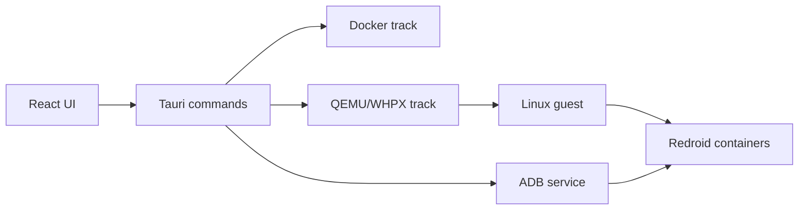

# JustRun

JustRun is a Windows desktop platform for Android automation development, device management, cloud-device control, and authorized testing. It is built with **Tauri 2 + React + TypeScript + Rust**, runs Redroid through either Docker Desktop or QEMU/WHPX nodes, and controls devices through ADB, scrcpy, and file/application APIs.

> [中文文档 / Chinese documentation](README.md)

## Contents

- [Documentation](#documentation)
- [Chinese version](README.md)

---

## Documentation

### 1. Project positioning

JustRun is a Tauri + React + Rust desktop application for managing Redroid-based Android environments. It provides one desktop surface for local Docker devices, QEMU/WHPX nodes, ADB operations, APK installation, files, logs, screenshots, scrcpy sessions, data volumes, and runtime diagnostics.

The project has two execution tracks:

| Track | Runtime | Best for | Main trade-off |
|---|---|---|---|
| Docker | Docker Desktop or native Docker runs Redroid directly | Fast local development and day-to-day device work | Depends on Docker, binder, kernel features, and image compatibility |
| QEMU/WHPX | QEMU starts a Linux guest; guest Docker runs Redroid | Node isolation, independent Linux environments, and multi-node workflows | More moving parts: WHPX, QEMU, SSH, cloud-init, disks, and guest services |

The UI is shared, but the two tracks are not interchangeable. A successful Docker container does not prove that the QEMU guest path works, and a passing Rust test does not prove that a real Android device is online.

### 2. Important boundaries

- Use the application only on machines, networks, images, and Android devices you own or are explicitly authorized to manage.
- Root, Zygisk, LSPosed, Shamiko, device spoofing, and trace-cleaning features are for authorized testing only. Do not bypass third-party security controls without authorization; the user assumes all consequences, and the authors and maintainers are not responsible for the results.
- A running process is not the same as an ADB-online device; an ADB-online device is not automatically scrcpy-ready.
- Android version, CPU architecture, kernel capabilities, Redroid image, GApps package, root modules, and host virtualization must match.
- Compatibility labels are evidence-based. `UNTESTED` means that the environment has not been validated; it must not be silently reported as supported.
- Destructive actions such as volume deletion, node purge, snapshot cleanup, and qcow2 operations require an explicit target and a recoverable workflow.
- Do not force-kill QEMU or modify a live qcow2 disk with `qemu-img`.

#### Use at your own risk and disclaimer

JustRun is released under the [MIT License](LICENSE). GApps, Magisk, LSPosed, Shamiko, Gnirehtet, and other third-party assets remain subject to their upstream licenses and distribution terms; confirm those terms before use, modification, redistribution, or commercial use.

JustRun does not promise absolute anti-reversing. Guest-side plaintext may still be observed by anyone with root, administrator, or debugging capabilities, and high-value logic should remain server-side. To the fullest extent permitted by applicable law, JustRun is provided “as is” and “as available”; use is entirely at the user’s own risk. The user is responsible for authorization, compliance, and all consequences of use. The authors and maintainers are not responsible for unauthorized use, bypassing third-party security controls, data loss, service interruption, compatibility issues, or resulting legal consequences.

### 3. Feature overview

| Area | Capabilities |
|---|---|
| Dashboard | Docker, ADB, online-device, CPU, memory, scrcpy, device, and notification status |
| Devices | Search, filter, multi-select, lifecycle actions, details, screenshots, shell, files, logcat, and app management |
| Containers and nodes | Docker containers, QEMU nodes, guest status, resource profiles, and node/device association |
| ADB | Local device management, LAN discovery, TCP connection, shell, file transfer, screenshots, and logcat |
| APK | APK selection, validation, single install, and batch installation |
| Data | Volumes, device data, cleanup, and explicit deletion workflows |
| Logs | Application, device, guest, QEMU, and diagnostic log views |
| Settings | Theme, language, shortcuts, runtime preferences, and update configuration |
| Desktop shell | Custom title bar, minimize/maximize/close controls, dragging, resize, system tray, and packaged icons |

### 4. Technology and repository layout

#### Technology stack

- Frontend: React 19, TypeScript, Vite, React Router, Zustand, Lucide icons, and CSS.
- Desktop shell: Tauri 2 with Rust commands, tray icon, dialog, global shortcut, and updater plugins.
- Backend: Rust/Tokio, Serde, Reqwest with rustls, SQLite with bundled SQLite, and platform-specific process integration.
- Device/runtime tools: Docker, Redroid, ADB, scrcpy, QEMU, WHPX, OpenSSH, cloud-init, and WSL binder where applicable.
- Tests: TypeScript type checking, Vitest, Testing Library, and Rust tests for `src-tauri` and `qemu-center`.

#### Repository layout

```text
src/                    React pages, components, stores, i18n, and frontend services
src-tauri/              Tauri commands, Rust services, capabilities, icons, and packaging
qemu-center/            Independent Rust CLI for nodes, VMs, guests, Redroid, and verification
scripts/                Platform detection, WSL/binder setup, and local asset helpers
docs/                   Getting started, compatibility, troubleshooting, and handoff documents
vendor/                 Local GApps, Magisk, and module assets; normally not committed
authorization-service/  Protected QEMU loader and authorization-related service code
public/                 Frontend static assets and the brand source logo
README.md               Chinese project documentation
README_EN.md            English project documentation
```

#### Runtime architecture



### 5. Support and compatibility

| Host/combination | Status | Notes |
|---|---|---|
| Windows x64 + Docker | Partially validated / beta target | Requires Docker Desktop, WSL2, binder, ADB, and a compatible Redroid image |
| Windows x64 + QEMU/WHPX | Partially validated / experimental | Requires WHPX, QEMU, OpenSSH, an Ubuntu cloud image, and sufficient disk space |
| Windows ARM64 | Experimental | Must use an ARM64 WSL kernel and matching image architecture; never use an x64 `bzImage` |
| Linux x64/ARM64 | Experimental | Uses the host binder rather than a Windows WSL kernel; image ABI must match |
| macOS | Experimental | Binder must be provided by the Docker Desktop Linux VM, QEMU, or a remote Linux host |
| Android 13 + x86_64 | Current primary target | Matches the GApps asset currently present in the repository |
| Android 14 + Android 13 GApps | Unsupported | Must be rejected before provisioning; do not continue with preinstallation |

See [`docs/compatibility.md`](docs/compatibility.md) for the authoritative matrix. It distinguishes validated, partially validated, experimental, unsupported, and untested states. Passing tests alone does not upgrade a compatibility label.

### 6. Build from source

#### 6.1 Prerequisites

- Node.js 20 or newer; the version is declared in `package.json`.
- npm.
- Stable Rust and Cargo.
- On Windows, Windows x64 is the recommended development environment and WebView2 must be available.
- Docker or QEMU dependencies are required only when running those tracks; frontend development does not require them.

#### 6.2 Install dependencies and start Tauri

```powershell
cd F:\code\project\JustRun
npm install
npm run tauri dev
```

`npm run tauri dev` starts Vite and the Rust/Tauri desktop window. The development frontend defaults to `http://127.0.0.1:1420`.

If ports 1420 or 1421 are held by an old Vite process, stop only the process belonging to this project and restart. Do not kill unrelated Node processes.

#### 6.3 Frontend-only preview

```powershell
npm run dev
```

The browser preview is useful for layout and selected mock-data flows. It does not provide real Docker, ADB, scrcpy, QEMU, tray, or native-window behavior, so it is not a desktop acceptance test.

#### 6.4 Build and package

```powershell
# Type check and Vite production build
npm run build

# Tauri application bundle
npm run tauri build
```

The Windows installer is normally placed under:

```text
src-tauri/target/release/bundle/nsis/
```

Packaged icons are read from `src-tauri/icons/`. The current desktop icon is generated from `public/justrun-logo.png`. After changing an icon, regenerate the platform assets, rebuild, and restart the application; Windows may cache the old taskbar or shortcut icon.

#### 6.5 Release builds with updater configuration

`npm run tauri:build:release` rejects a release build without an HTTPS update endpoint and a signing public key:

```powershell
$env:RDC_UPDATE_ENDPOINT = "https://updates.example.invalid/justrun/latest.json"
$env:RDC_UPDATE_PUBKEY = Get-Content -Raw -LiteralPath ".\\release\\tauri-updater-public-key.txt"
npm run tauri:build:release
```

Protected QEMU guest-loader release builds also require `RDC_AUTH_EXECUTION_RELEASE_URL` and `RDC_AUTH_PUBLIC_KEYS` from the release environment. Never place a server-side signing private key in the desktop build.

### 7. Docker track

The Docker track is the recommended first path for local development. Docker Desktop supplies the container runtime while JustRun manages instances, ADB, screenshots, logs, and the desktop workflow.

#### 7.1 Dependencies and first setup

- Windows: Docker Desktop, WSL2, a working WSL binder, and ADB; install scrcpy when screen mirroring is needed.
- Linux: Docker, the host binder, and ADB; Windows WSL-kernel scripts are not applicable.
- macOS: Docker Desktop provides the Linux VM; binder and image architecture must match that VM.
- Redroid: choose an image compatible with the host architecture, Android version, and kernel capabilities.

On Windows, start with platform detection:

```powershell
.\scripts\detect-platform.ps1
```

To install or update the WSL kernel:

```powershell
.\scripts\install-wsl-kernel.ps1 -Apply
# Or use the one-click binder flow
.\scripts\setup-wsl-binder-oneclick.ps1 -Apply
```

These scripts prepare WSL kernel/binder components. They do not install Docker Desktop or fix an ABI-mismatched image. See [`scripts/README-WSL-KERNEL.md`](scripts/README-WSL-KERNEL.md) for platform rules.

#### 7.2 Create the first base device

For the first run, create a device without GApps, root, or advanced modules:

1. Start Docker Desktop and verify that the Docker daemon is available.
2. Open Containers & Nodes in JustRun and select the Docker track.
3. Check Docker, WSL/binder, ADB, and image status.
4. Create a device with the default or minimal resource profile.
5. Wait for the container to appear in the ADB device list.
6. Open device details and verify screenshots, shell, files, and logs.

“Started” means the container process is running. “Online” requires an ADB connection. “Mirror-ready” also requires scrcpy and working device graphics. If a device is offline, inspect container and ADB logs before retrying.

#### 7.3 GApps preinstallation

The current local GApps asset is:

```text
vendor/gapps/MindTheGapps-13.0.0-x86_64-20231025_201203.zip
```

Use the helper script to fetch or update it:

```powershell
.\scripts\fetch-mindthegapps.ps1
```

This asset targets Android 13 x86_64. It is not a universal GApps package and must not be used for Android 14. When Android version or architecture does not match, provisioning must stop before writing the device. Vendor assets are normally not committed and must follow their upstream source, authorization, and license rules. Gnirehtet is expected to be installed or configured by the user; this repository does not bundle its `.exe` or `.apk` files.

#### 7.4 Root and advanced profiles

Advanced profiles are intended for authorized internal testing, compatibility validation, and automation. The repository has integration points for Magisk, Zygisk, LSPosed, Shamiko, DeviceCloak, and related modules, but stability depends on the Android version, image, kernel, and module versions.

For example:

```powershell
.\scripts\fetch-magisk.ps1
```

Use the sequence “base device → GApps → root → one advanced module at a time.” Preserve logs and device configuration when a module fails, then return to the last known-good profile.

#### 7.5 Data, volumes, and deletion

- Deleting a container does not necessarily delete its persistent volume.
- Deleting a volume can remove application data, user data, and debugging evidence.
- Export logs, device configuration, and relevant screenshots before cleanup.
- Confirm the exact target in the Data Volumes page before destructive deletion.

Recreating a container is not a data-preserving operation by itself; data retention depends on the volume and device lifecycle configuration.

### 8. QEMU/WHPX track

The QEMU track uses a Linux virtual machine as a node. The host runs QEMU/WHPX, the guest runs Docker and Redroid, and JustRun reaches guest devices through node management, port forwarding, and ADB. It is useful for node isolation and independent Linux environments, but has more operational dependencies than Docker.

#### 8.1 Windows prerequisites

- Windows x64 with hardware virtualization enabled in firmware.
- WHPX (Windows Hypervisor Platform).
- `qemu-system-x86_64` and `qemu-img`.
- OpenSSH client and ADB.
- A bootable Ubuntu cloud image with the required cloud-init configuration.
- At least 40 GiB of free disk space; actual use depends on node count, images, and logs.

In an elevated PowerShell:

```powershell
DISM /Online /Enable-Feature /FeatureName:HypervisorPlatform /All
Enable-WindowsOptionalFeature -Online -FeatureName VirtualMachinePlatform -NoRestart
```

Restart as requested. Enable WHPX, install QEMU, create disks, and start guests as separate, verifiable steps rather than one irreversible command.

#### 8.2 CLI quick start

`qemu-center` is an independent Rust CLI. Run these commands from the repository root with an explicit manifest:

```powershell
# Environment checks
cargo run --manifest-path qemu-center/Cargo.toml -- doctor
cargo run --manifest-path qemu-center/Cargo.toml -- doctor --json

# Prepare node resources
cargo run --manifest-path qemu-center/Cargo.toml -- setup all

# Create, start, and wait for a node
$ubuntuCloudImage = "C:\\images\\ubuntu-22.04-server-cloudimg-amd64.img"
cargo run --manifest-path qemu-center/Cargo.toml -- vm create node1 --image $ubuntuCloudImage
cargo run --manifest-path qemu-center/Cargo.toml -- vm start node1
cargo run --manifest-path qemu-center/Cargo.toml -- guest wait node1 --timeout-secs 600

# Inspect and verify
cargo run --manifest-path qemu-center/Cargo.toml -- vm list
cargo run --manifest-path qemu-center/Cargo.toml -- redroid list node1
cargo run --manifest-path qemu-center/Cargo.toml -- adb list
cargo run --manifest-path qemu-center/Cargo.toml -- verify --vm node1
```

The first guest boot may include cloud-init, networking, Docker startup, and Redroid startup. It can take much longer than a normal container. UI actions are graphical entry points for these workflows; when state disagrees, use the CLI and guest/QEMU logs as the source of truth.

#### 8.3 Lifecycle commands

| Stage | Command | Purpose |
|---|---|---|
| Check | `doctor` | Check QEMU, WHPX, SSH, ADB, disk, and image prerequisites |
| Create | `vm create` | Create node configuration and virtual disk |
| Start | `vm start` | Start the QEMU process |
| Wait | `guest wait` | Wait for SSH, Docker, and guest services |
| Stop | `vm stop` | Stop the node through its normal lifecycle |
| Resize | `vm set-memory` | Change node memory configuration |
| Reclaim | `vm memory-reclaim` | Reclaim guest memory under explicit conditions |
| Snapshot | `vm snapshot` | Create or manage node snapshots |
| Clone | `vm clone` | Copy an existing node into a new node |
| Delete | `vm delete` | Delete a node; `--purge` performs deeper cleanup |
| Devices | `redroid list` | List Redroid instances inside the guest |
| Verify | `verify` | Validate node and device readiness |
| Profiles | `lean`, `standard`, `full` | Select resource presets and startup expectations |

Start with `lean` or `standard`, then increase resources only after measuring device count and workload. Record explicit memory overrides in the node configuration or issue report.

#### 8.4 Safety and failure handling

- Do not kill QEMU with Task Manager or `Stop-Process -Force`; use `vm stop`.
- Do not perform structure-changing `qemu-img` operations against a live qcow2 disk.
- Preserve `qemu.log`, `console.log`, node configuration, and the failed command.
- Treat `UNTESTED` as missing validation, not as a definite failure or support claim.
- `vm memory-reclaim` is explicit and fail-closed: it must not silently stop a node or modify qcow2 state.

See [`qemu-center/README.md`](qemu-center/README.md) and [`docs/getting-started/qemu-whpx-track.md`](docs/getting-started/qemu-whpx-track.md) for guest images, SSH, lifecycle, and acceptance details.

### 9. Using the desktop application

#### 9.1 Devices and details

The application provides search, filtering, multi-select, and batch operations. Device details normally include:

- ADB state, serial number, Android version, and source node.
- Screenshots, shell, file browsing, logcat, APK installation, and app management.
- Start, stop, restart, and delete lifecycle actions.
- Batch installation, startup, or shutdown for multiple devices.

Risky actions for offline devices should be disabled or require reconfirmation. “Started” in the list must not replace an ADB-online check.

#### 9.2 ADB LAN discovery

The ADB page can discover devices on an authorized LAN range and try available ADB TCP endpoints. Discovery is a device-management feature, not an authentication bypass:

- Scan only networks the user is authorized to manage.
- Do not scan public or unrelated networks.
- Preserve the target address and error when a connection fails; do not retry forever.
- Android version, wireless debugging pairing, and ADB-over-TCP mode affect results.

#### 9.3 APKs, files, and logs

- The APK page supports selection, validation, single installation, and batch installation.
- File operations must distinguish local paths, device paths, and remote-node paths.
- The Logs page is used for viewing, filtering, and exporting diagnostics.
- Redact serial numbers, IP addresses, tokens, usernames, and local absolute paths before sharing logs.

#### 9.4 Internationalization and themes

The primary languages are `zh-CN` and `en-US`. Themes support light, dark, and system modes. Translation resources live under `src/i18n/` and the relevant page files; components should use `useI18n().t` or `tStatic` instead of hard-coding a single-language string.

Backend CLI and low-level tool errors may still be in Chinese or in the original English. Keep original low-level errors when they are useful for diagnosis, while user-facing page copy should remain consistent.

### 10. Configuration, assets, and runtime data

| Path | Purpose | Commit? |
|---|---|---|
| `src-tauri/tauri.conf.json` | Tauri window, packaging, resources, and updater configuration | Yes |
| `src-tauri/capabilities/default.json` | Tauri permissions and command capabilities | Yes |
| `src-tauri/icons/` | Desktop, taskbar, installer, and platform icons | Yes |
| `public/justrun-logo.png` | Current brand source image | Follow repository status |
| `vendor/gapps/` | Local GApps assets | Normally no |
| `vendor/magisk/`, etc. | Local root/module assets | Normally no |
| `qemu-center/state/` | QEMU node state, disks, and runtime data | No |
| `src-tauri/target/`, `target/` | Rust build output | No |
| Local log directories | Application, QEMU, and guest logs | No |

Never commit secrets, signing private keys, SSH private keys, device data, qcow2 disks, download caches, real logs, or screenshots containing personal information. After an icon change, regenerate `src-tauri/icons/` and rebuild; Windows may require the old process to exit before the taskbar icon refreshes.

### 11. Development, testing, and acceptance

Quick frontend checks:

```powershell
npx tsc --noEmit
npx vitest run
npm run build
```

Full validation gate:

```powershell
npx tsc --noEmit
npx vitest run
cargo test --manifest-path src-tauri/Cargo.toml
cargo test --manifest-path qemu-center/Cargo.toml
npm run build
git diff --check
```

Before submitting a change:

1. Check UI changes in the desktop window, the browser preview, and multiple DPI/layout conditions.
2. Update Tauri capabilities and tests together when Rust or window permissions change.
3. Do not use mocks alone to claim real Docker, ADB, scrcpy, or QEMU behavior; state manual acceptance status explicitly.
4. For QEMU changes, validate state transitions and failure rollback before long guest runs.
5. Update both `README.md` and `README_EN.md`, the relevant guide, and the compatibility notes.

### 12. Troubleshooting

| Symptom | First checks |
|---|---|
| Docker unavailable | Docker Desktop, WSL2, binder, image architecture, and `docker info` |
| Container starts but device is offline | ADB server, container logs, port mapping, and Redroid startup logs |
| GApps installation fails | Android version, CPU architecture, asset name, and authorization state |
| QEMU does not start | Firmware virtualization, WHPX, QEMU path, free disk, and port conflicts |
| Guest never becomes ready | cloud-init, SSH, Docker service, networking, `qemu.log`, and `console.log` |
| qcow2 state is damaged | Whether shutdown completed; do not run dangerous `qemu-img` operations while live |
| scrcpy cannot mirror | ADB state, scrcpy path, graphics capability, and device permissions |
| Custom window buttons do nothing | Window permissions in `src-tauri/capabilities/default.json`, frontend window API, and a full Tauri restart |
| Taskbar still shows the old logo | Regenerate `src-tauri/icons/`, rebuild, exit the old process, and refresh Windows icon cache if necessary |

See [`docs/troubleshooting.md`](docs/troubleshooting.md) for detailed steps. When filing an issue, include OS version, CPU architecture, JustRun version, track, image version, relevant redacted logs, and a minimal reproduction.

### 13. Contributing

Read [`CONTRIBUTING.md`](CONTRIBUTING.md), [`AGENTS.md`](AGENTS.md), and [`docs/AI-HANDOFF-NEXT-STEPS.md`](docs/AI-HANDOFF-NEXT-STEPS.md) before development. The recommended workflow is:

1. Confirm the requirement, scope, compatibility boundary, and destructive effects.
2. For a feature change, write a proposal in `docs/superpowers/specs/`, then an implementation plan in `docs/superpowers/plans/`.
3. Write a reproducing test or acceptance condition before implementation where practical.
4. Pass type checking, unit tests, Rust tests, and build checks at each stage.
5. Preserve other users' uncommitted changes; do not commit secrets, real device data, or private vendor assets.
6. Backend, QEMU lifecycle, and data-deletion changes require explicit authorization and a safe rollback path.

### 14. Related documentation

- [Windows clean environment](docs/getting-started/windows-clean.md)
- [Docker track guide](docs/getting-started/docker-track.md)
- [QEMU/WHPX track guide](docs/getting-started/qemu-whpx-track.md)
- [Compatibility matrix](docs/compatibility.md)
- [Troubleshooting](docs/troubleshooting.md)
- [QEMU Center CLI](qemu-center/README.md)
- [WSL kernel and binder guide](scripts/README-WSL-KERNEL.md)
- [Authorization service](authorization-service/README.md)
- [Contributing guide](CONTRIBUTING.md)
- [Project collaboration rules](AGENTS.md)

## Documentation index

| Document | Purpose |
|---|---|
| [Windows clean environment](docs/getting-started/windows-clean.md) | Clean Windows setup and first-run preparation |
| [Docker track guide](docs/getting-started/docker-track.md) | Detailed Docker-track workflow |
| [QEMU/WHPX track guide](docs/getting-started/qemu-whpx-track.md) | QEMU/WHPX node preparation and operation |
| [Compatibility matrix](docs/compatibility.md) | Compatibility states and evidence rules |
| [Troubleshooting](docs/troubleshooting.md) | Common failures and diagnostic order |
| [QEMU Center CLI](qemu-center/README.md) | QEMU Center CLI and safety boundaries |
| [WSL kernel and binder guide](scripts/README-WSL-KERNEL.md) | WSL kernel, architecture, and binder |
| [Authorization service](authorization-service/README.md) | Authorization service and protected loader |
| [Contributing guide](CONTRIBUTING.md) | Contribution, testing, and submission rules |
| [Project collaboration rules](AGENTS.md) | AI collaboration and repository rules |
